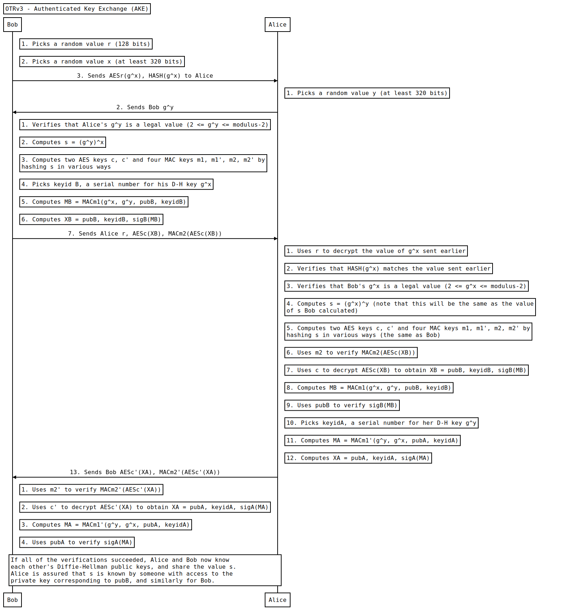

# OTRVv3 Sequence Diagrams

This repository intends to be the place to share the OTRv3[\[1\]](#references)
diagrams in order to fully understand the protocol.

## Authenticated Key Exchange (AKE) Diagram[\[2\]](#references)

## Data Exchange Diagram

## Socialist Millionaires' Protocol (SMP) Diagram

## Generating the diagrams

To generate the diagrams I have used
[js-sequence-diagrams](https://bramp.github.io/js-sequence-diagrams/) tool. The
source code to regenerate the diagrams is store at `jssd` folder, and the
compiled SVGs are kept on `img` folder.

## References

[1] - https://otr.cypherpunks.ca/Protocol-v3-4.1.1.html
[2] - https://en.wikipedia.org/wiki/Key_exchange
